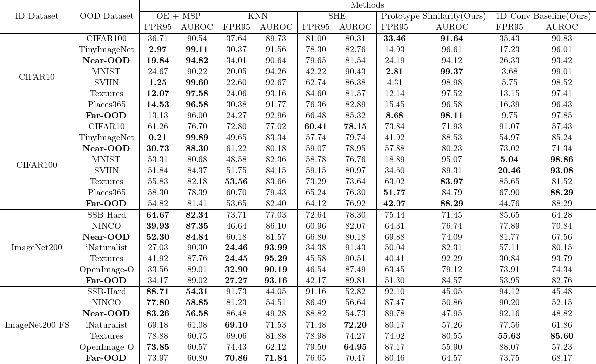

# Prototype Similarity
Repository for the out-of-distribution(OOD) detection method named Prototype Similarity

## Metrics
Metrics for CIFAR10, CIFAR100, ImageNet-200, ImageNet-200-FS can be found in metrics/

## Reproduce
Important: This repository only works in unix, due to OpenOOD library having the same requirement.

### Create Environment
```
$ conda create -n prototype_similarity python=3.10
$ conda activate prototype_similarity
$ pip3 install torch torchvision torchaudio --index-url https://download.pytorch.org/whl/cu118
$ pip install -r requirements.txt
```

### Run
- Run script_data_download.sh
- Run script_reproduce.sh

Reproduction script trains the OOD detection models on CIFAR10, CIFAR100, ImageNet-200 datasets, then tests them on OpenOOD benchmarks.
download_data.py script was copied from: https://github.com/Jingkang50/OpenOOD/blob/main/scripts/download/download.py

Before running script_reproduce.sh, download one or all parts of the imagenet1k dataset, place them under data/images_largescale/imagenet_1k/train

Download from: https://huggingface.co/datasets/ILSVRC/imagenet-1k/tree/main/data


## Results



